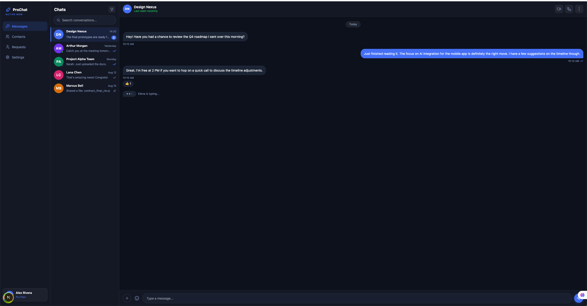
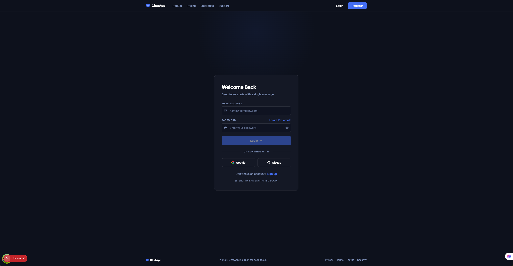
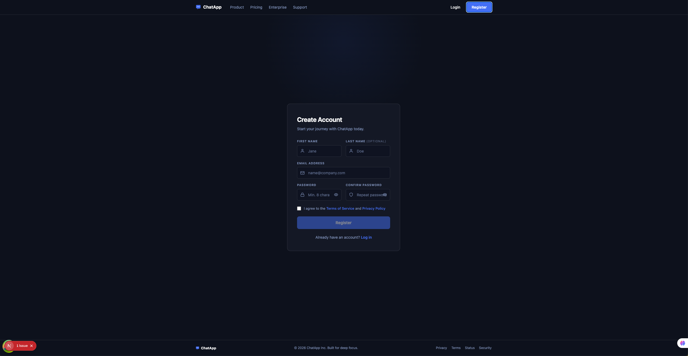
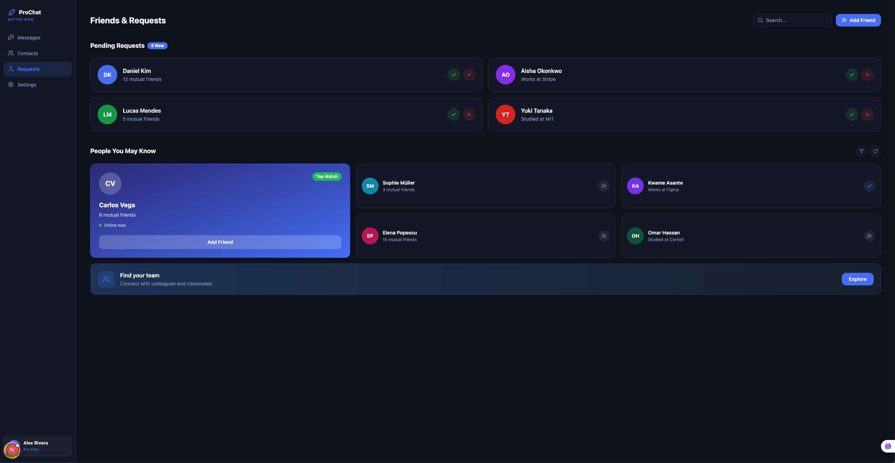

# Chat App Microfrontend

Nx monorepo. Three Module Federation apps wired into one chat experience: a Next.js shell host that consumes a React remote (chat) and an Angular remote (contacts).

<p align="center">
  
</p>

## Stack

| Layer | Choice |
|---|---|
| Monorepo | Nx 22 + pnpm (lockfile v9) |
| Node | 24.14.1 (`.nvmrc`) |
| Shell | Next.js 16 (App Router) |
| Chat MFE | React 19 + Rspack |
| Contacts MFE | Angular 21 + Webpack |
| Module Federation | `@module-federation/enhanced` (Rspack/Webpack) + Next.js MF runtime |
| Server state | TanStack Query v5 (`@tanstack/react-query`, `@tanstack/angular-query-experimental`) |
| Styling | Tailwind 3 + SCSS, Mantine (React), Angular Material |
| Auth | Cookie-based access + refresh, BFF on shell |
| AI assistance | Claude (Anthropic) — used for development via Claude Code |

## Apps

| App | Path | Port | Role | MF role |
|---|---|---|---|---|
| `shell` | `apps/shell` | 3000 | Host / BFF / auth | Consumes both remotes |
| `mfe_chat` | `apps/mfe-chat` | 4201 | Messages UI | Remote — exposes `./Module` |
| `mfe_contacts` | `apps/mfe-contacts` | 4202 | Contacts + friend requests | Remote — exposes `./Routes`, `./Mount` |

All three must run simultaneously for the full experience. The shell dynamically loads `localhost:4201/remoteEntry.js` and `localhost:4202/remoteEntry.js` at runtime.

## Screenshots

| Login | Register |
|---|---|
|  |  |

| Chat (mfe_chat) | Contacts (mfe_contacts) |
|---|---|
|  |  |

| Friend requests | Architecture |
|---|---|
|  |  |

> Drop captures into `docs/screenshots/` using the filenames above. See `docs/screenshots/README.md`.

## Getting started

```bash
nvm use                  # Node 24.14.1
pnpm install
pnpm start               # all three apps in parallel
```

Open http://localhost:3000.

### Run individually

```bash
pnpm start:shell         # 3000
pnpm start:chat          # 4201
pnpm start:contacts      # 4202
```

### Build

```bash
pnpm build               # all
pnpm build:shell
pnpm build:chat
pnpm build:contacts
```

### Code quality

```bash
pnpm lint
pnpm test
pnpm typecheck

# Nx affected (CI)
pnpm affected:lint
pnpm affected:test
pnpm affected:build
```

### Nx graph

```bash
pnpm graph
```

## Architecture

### Module Federation

- `apps/shell/next.config.js` registers remotes and shares `react`/`react-dom` as eager singletons.
- mfe_chat entry: `apps/mfe-chat/src/remote-entry.ts` → exports default `App` component as `./Module`.
- mfe_contacts entry: `apps/mfe-contacts/src/app/remote-entry/entry.routes.ts` → exposes Angular lazy routes as `./Routes`. `apps/mfe-contacts/src/remote-mount.ts` exposes a manual `mount(container)` API as `./Mount` for non-Angular hosts.
- Shell renders the Angular remote through `apps/shell/src/components/AngularMfeHost.tsx` / `AngularMfePortal.tsx`, which call `mount()` and bridge router events via `apps/shell/src/components/NavigationBridge.tsx`.

### Auth (shell BFF)

Login/register/refresh/logout are server-only routes in the shell. They call the NestJS backend, then write `access_token` (15 min) and `refresh_token` (7 days) as `httpOnly` cookies. The browser never sees raw tokens.

| Concern | File |
|---|---|
| Backend base URL + paths | `apps/shell/src/lib/constants.ts` |
| Cookie helpers | `apps/shell/src/lib/server/auth-cookies.ts` |
| Refresh helpers + `withAuth` wrapper | `apps/shell/src/lib/server/refresh.ts` |
| BFF routes | `apps/shell/src/app/api/auth/*`, `apps/shell/src/app/api/users/*` |
| Client fetch wrapper (refresh-and-retry) | `apps/shell/src/lib/api/client.ts` |
| Auth guard | `apps/shell/src/proxy.ts` |
| Pages | `apps/shell/src/app/(auth)/{login,register,onboarding}/page.tsx` |

#### Refresh flow

1. Access cookie present → request proceeds.
2. Access cookie missing / 401 from backend:
   - **Server side** (BFF route): `withAuth()` calls `/auth/refresh`, rotates cookies, retries the upstream call once.
   - **Client side**: `authedFetch()` sees 401, POSTs `/api/auth/refresh`, retries the original request once. Concurrent callers share a single in-flight refresh promise.
3. Refresh fails → cookies cleared, client redirects to `/login?from=...`.

The proxy (`apps/shell/src/proxy.ts`) treats either cookie as authenticated, so a user with a valid refresh token but expired access token is not kicked out — the page renders and the next API call refreshes transparently.

### Server state (TanStack Query)

Wired in all three apps with the same defaults: `staleTime: 60s`, no refetch-on-focus, query retry 1, mutation retry 0.

| App | Provider | Hooks |
|---|---|---|
| shell | `apps/shell/src/components/QueryProvider.tsx` (wraps `RootLayout`) | `apps/shell/src/lib/api/queries.ts` |
| mfe_chat | `QueryClientProvider` inside `apps/mfe-chat/src/app/app.tsx` (self-wrapped so it works both standalone and federated) | colocated per feature |
| mfe_contacts | `provideTanStackQuery(...)` in `apps/mfe-contacts/src/app/app.config.ts` | `apps/mfe-contacts/src/app/lib/queries.ts` (`injectQuery` / `injectMutation`) |

Devtools are enabled in development for the React apps.

## AI assistance — Claude

This project is built with [Claude](https://www.anthropic.com/claude) as the primary AI pair-programming assistant, accessed through [Claude Code](https://docs.claude.com/en/docs/claude-code/overview) (Anthropic's official CLI).

### What Claude is used for

- Scaffolding features across the monorepo (auth flow, refresh tokens, TanStack Query wiring, Module Federation glue)
- Cross-framework refactors that touch React, Angular, and Next.js in one pass
- Reviewing diffs before commit and catching cross-app regressions
- Generating commit messages and PR descriptions

### Project conventions for Claude

The repo includes a `CLAUDE.md` at the root — Claude Code reads it on every session and uses it as the source of truth for stack, commands, and architecture. Keep it updated when you change ports, add a new app, or shift conventions; everything else (this README, generated PRs) flows from it.

Recommended workflow:

```bash
# In the repo root
claude                  # start a Claude Code session
# then ask: "/review", "add a contacts search endpoint", etc.
```

Useful slash commands inside Claude Code:

| Command | What it does |
|---|---|
| `/review` | Reviews the current branch diff |
| `/security-review` | Runs a security-focused review of pending changes |
| `/init` | Refreshes `CLAUDE.md` from the current codebase |

### Guardrails

- Claude operates on the working tree but **does not** push, force-push, or amend published commits without explicit instruction.
- Backend secrets, `.env`, and credential files are excluded from any commit Claude proposes.
- All AI-authored commits include a `Co-Authored-By` trailer so attribution is visible in `git log`.

### Optional — runtime AI features

If you want Claude inside the running app (e.g. an AI-replies feature in mfe_chat), call the [Anthropic API](https://docs.claude.com/en/api/overview) from the shell BFF rather than the browser — your `ANTHROPIC_API_KEY` must never reach the client. A new `apps/shell/src/app/api/ai/` route handler is the right place.

## Routing

Cross-app paths are centralized in `apps/shell/src/lib/constants.ts` (`ROUTES`) and `apps/mfe-contacts/src/app/utils/routes.ts`. Always import from there — don't hardcode.

| Path | Owner |
|---|---|
| `/` | shell → mfe_chat |
| `/contacts`, `/contacts/add-friends`, `/contacts/requests` | shell → mfe_contacts |
| `/settings`, `/login`, `/register`, `/onboarding` | shell |

## Key config files

- `nx.json` — caching, default targets, Nx plugins
- `tsconfig.base.json` — shared path aliases
- `eslint.config.mjs` — workspace-wide ESLint (Nx module-boundary rules apply)
- `.prettierrc` — `singleQuote: true`
- `apps/shell/next.config.js` — Next.js + Module Federation remotes
- `apps/mfe-chat/rspack.config.ts` + `module-federation.config.ts`
- `apps/mfe-contacts/webpack.config.ts` + `module-federation.config.ts`

## Project structure

```
apps/
  shell/                 # Next.js host + BFF
    src/app/(app)/       # authenticated routes
    src/app/(auth)/      # login / register / onboarding
    src/app/api/         # BFF: auth, users
    src/components/      # AngularMfeHost, NavigationBridge, QueryProvider, ...
    src/lib/             # constants, api client, server helpers
    src/proxy.ts         # auth guard (Next.js 16 proxy, formerly middleware)
  mfe-chat/              # React + Rspack remote
    src/app/             # AppShell, components, hooks, query-client
    src/remote-entry.ts  # MF entry
  mfe-contacts/          # Angular + Webpack remote
    src/app/remote-entry/  # Angular routes exposed via MF
    src/app/lib/         # api + TanStack Query injectors
    src/remote-mount.ts  # imperative mount API for non-Angular hosts
```
